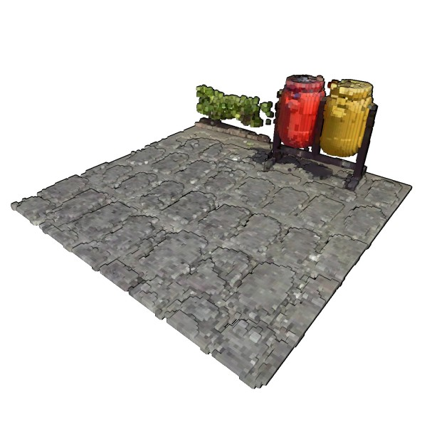
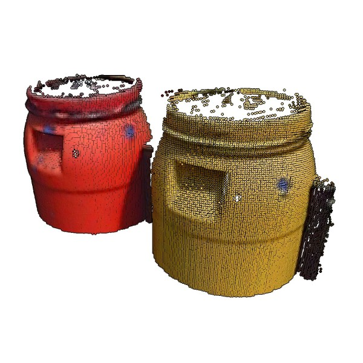
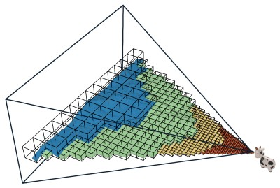
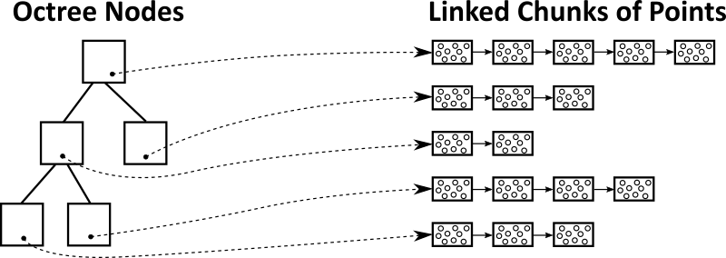

# SimLOD: Simultaneous LOD Generation and Rendering
Markus Schütz, Lukas Herzberger, Michael Wimmer

Paper: <a href="https://www.cg.tuwien.ac.at/research/publications/2023/SCHUETZ-2023-SIMLOD/SCHUETZ-2023-SIMLOD-paper.pdf">"SimLOD: Simultaneous LOD Generation and Rendering"</a><br>
Binaries: <a href="https://github.com/m-schuetz/SimLOD/releases/">SimLOD 1.0</a> (May require a CUDA 11.8 installation due to hot reload? We'll work on a standalone binary)

This project loads point clouds, creates an LOD structure on-the-fly, and immediatelly displays the results in real time. 


On an RTX 4090 and PCIe 5.0 SSD (12GB/s), we are able to load and real-time render point clouds at rates of about 200-300 million points per second (MP/s) from the LAS format, 30 MP/s from compressed LAZ files, and up to 580 MP/s from an optimal XYZRGBA(16bytes/point) format.

Right now we only display data sets that fit in GPU memory, but support for arbitarily large point clouds is in development.

<table>
<tr style="border: none">
	<td></td>
	<td></td>
</tr>
<tr style="border: none">
	<td colspan="2" style="border: none">
	Figure: Drag&Dropping 680 million points (11GB). Loaded in 1.7 seconds (400 MP/s; 6.4GB/s). 
	</td>
</tr>
</table>

The generated LOD structure is an octree that stores voxels in inner nodes and original point cloud data in leaf nodes. Voxels are created by sampling on a 128³ grid. Due to the sparsity in surfacic data sets, the voxels themselves are stored in lists instead of grids. In order to support growing amounts of voxels and points as new data is inserted into the octree, we use linked lists of chunks of points/voxels. 

<table>
<tr style="border: none">
	<td></td>
	<td></td>
	<td></td>
	<td></td>
</tr>
<tr style="border: none">
	<td>(a) Inner node with voxels.</td>
	<td>(b) Leaf node with points.</td>
	<td>(c) LOD </td>
	<td>(d) Point/Voxel storage via linked-lists</td>
</tr>
<tr style="border: none">
	<td colspan="4" style="border: none">
	Figure: Inner nodes comprise representative voxels with a resolution of 128³ and leaf nodes store the full-precision point cloud data. We render the LOD at a resolution that results in pixel-sized voxels to give the impression of looking at the full-res data. 
	</td>
</tr>
</table>
<!-- 
<table>
<tr style="border: none">
	<td></td>
	<td></td>
</tr>
<tr style="border: none">
	<td colspan="2" style="border: none">
	Figure: Left: Selection of octree nodes for the current viewpoint. Higher-level nodes close to the camera, lower-level nodes in the distance. Right: Points/Voxels are stored in linked lists of chunks.
	</td>
</tr>
</table> -->

During rendering, a CUDA kernel first computes a list of visible octree nodes. Each node is then rendered by one workgroup that iterates through the node's chunks and the stored points and voxels, and draws them with atomic operations. 


## Getting Started

### Install Dependencies

* CUDA Toolkit 11.8

### Build & Run

#### Prebuilt windows binaries

* Prebuilt binaries are available at the release page: https://github.com/m-schuetz/SimLOD/releases/

#### Windows with Visual Studio 2022

* Create Visual Studio 2022 project files:

```
mkdir build
cd build
cmake ../ -G "Visual Studio 17 2022" -A x64
```

* Open build/SimLOD.sln
* Switch to Release mode
* Compile and Run (Ctrl + F5)
* Drag&Drop point clouds in *.las, *.laz or *.simlod format into the application.

#### Windows or Linux with CMake

```
mkdir out && cd out         # Create a build directory
cmake .. && make            # Configure CMake and build the SimLOD target
./SimLOD                    # Run SimLOD
```


### Notes

* The environment variable ```CUDA_PATH``` needs to point to the install location of CUDA Toolkit 11.8 (e.g., ```/usr/local/cuda-11.8```)
* If you want to modify and hot reload CUDA code at runtime, make sure to set the work directory to the top-most folder of this repository instead of the binary target path. The project loads cuda files located relative to "./modules".

## Software Architecture


<table>
	<tr>
		<th>File</th>
		<th>Description</th>
	</td>
	<tr>
		<td>main_progressive_octree.cpp</td>
		<td>C++ entry point.</td>
	</tr>
	<tr>
		<td>render.cu</td>
		<td>CUDA kernel that renders the scene. </td>
	</tr>
	<tr>
		<td>progressive_octree_voxels.cu</td>
		<td>CUDA kernel that incrementally updates the octree.</td>
	</tr>
</table>

## Data Sets

Different subsets of San Simeon, specifically the Morro Bay area, are provided as test data. Each archive contains the same point cloud in las, laz and simlod formats.

* <a href="https://users.cg.tuwien.ac.at/~mschuetz/permanent/morro_bay_36M.zip">Morro Bay (36M points)</a>
* <a href="https://users.cg.tuwien.ac.at/~mschuetz/permanent/morro_bay_73M.zip">Morro Bay (73M points)</a>
* <a href="https://users.cg.tuwien.ac.at/~mschuetz/permanent/morro_bay_167M.zip">Morro Bay (167M points)</a>
* <a href="https://users.cg.tuwien.ac.at/~mschuetz/permanent/morro_bay_350M.zip">Morro Bay (350M points)</a>

The <a href="https://doi.org/10.5069/G9CN71V5">full San Simeon data set (18 billion points)</a> is available at Open Topography:
<pre>PG&E Diablo Canyon Power Plant (DCPP): San Simeon and Cambria Faults, CA. Distributed by OpenTopography. https://doi.org/10.5069/G9CN71V5 . Accessed: 2023-10-05
</pre>


## Bibtex

<pre>
@article{SimLOD,
    title =      "SimLOD: Simultaneous LOD Generation and Rendering",
    author =     "Markus Schütz and Lukas Herzberger and Michael Wimmer",
    year =       "2023",
    month =      oct,
    journal =    "Arxiv",
    keywords =   "point-based rendering",
}
</pre>

## References

Most relevant related work:

* WAND, MICHAEL, BERNER, ALEXANDER, BOKELOH,
MARTIN, et al. “Processing and interactive editing of huge point clouds
from 3D scanners”. Computers & Graphics 32.2 (2008), 204–220 2–4,10.
* GOBBETTI, ENRICO and MARTON, FABIO. “Layered Point
Clouds: A Simple and Efficient Multiresolution Structure for Distributing and Rendering Gigantic Point-sampled Models”. Comput. Graph.
28.6 (2004), 815–826 2, 3.
* SCHÜTZ, MARKUS, KERBL, BERNHARD, KLAUS, PHILIP,
and WIMMER, MICHAEL. GPU-Accelerated LOD Generation for Point
Clouds. Feb. 2023.
